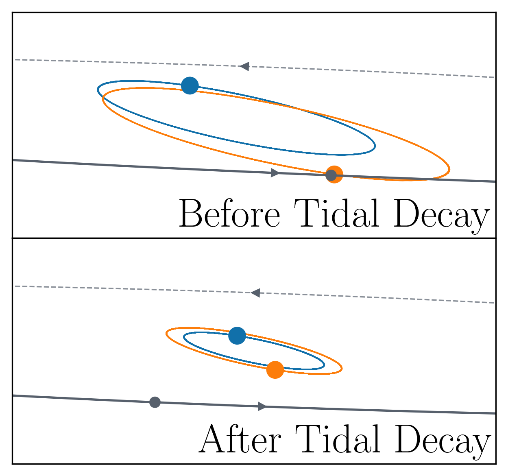

# Concealing Circumbinary Planets with Tidal Shrinkage



This repository contains the source code and analysis tools for the paper *"Concealing Circumbinary Planets with Tidal Shrinkage"* by Mogan & Zamazzi (2024). The study investigates the observational bias against detecting transiting circumbinary planets around short-period binaries due to tidal orbital decay.

## Description
The paper explores why no transiting circumbinary planets have been detected around binaries with orbital periods <7 days. Using population synthesis simulations, the authors model how tidal circularization and shrinkage of stellar binaries reduce transit probabilities, potentially "hiding" planets. The repository includes:
- **Simulation code** for orbit modeling of binary systems and planetary transit detection.
- **Jupyter notebooks** to reproduce figures from the paper.

## Installation

```bash
git clone https://github.com/saahitmog/circumbinary.git
cd circumbinary
```

## Contents

- `src/`: Source code for the popuulation synthesis simulations
- `figs/`: Jupyter notebooks and Python files to recreate figures from the paper
- `data/`: Simulation results and processed data

## Usage

To run the main simulations:

```bash
bash run_model.sh -n 10000 -e 4.5 -d 1.0 -a 0.0 -p 4.0  
```
- `-n`: number of systems to simulate
- `-e`: $\eta$
- `-d`: $\sigma_m$
- `-a`: $\alpha$
- `-p`: $P_{\rm env}$

See the paper for the definitions for these tuneable parameters. 

To reproduce the figures from the paper run the cells in `figs/paper_plots.ipynb`.

## Acknowledgments

This research was supported by the Berkeley Physics Undergraduate Research Scholars Program (BPURS), the Heising-Simons Foundation 51 Pegasi b Postdoctoral Fellowship, and used the Savio computational cluster resource provided by the Berkeley Research Computing program at the University of California, Berkeley.